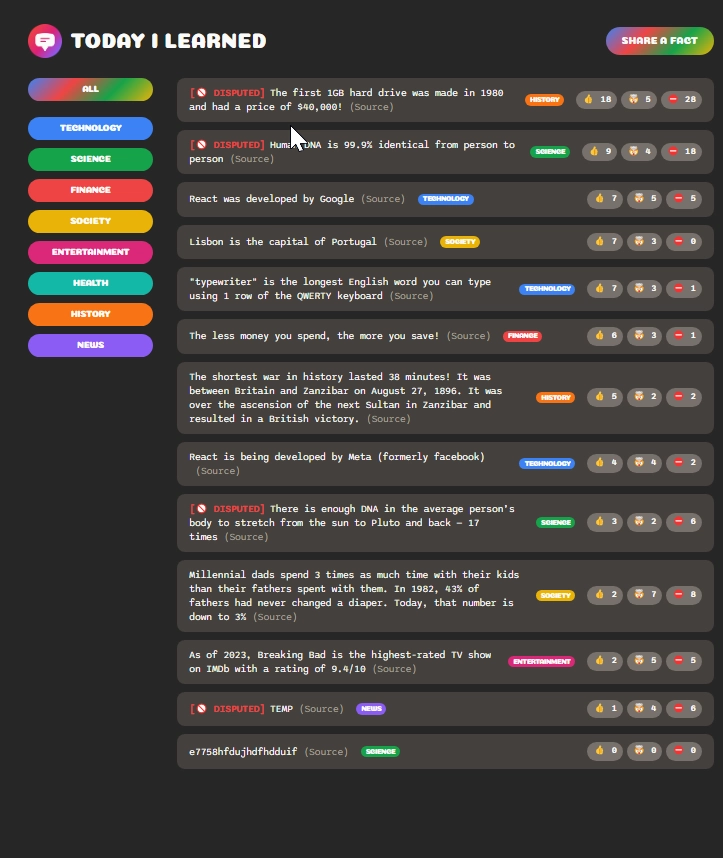

### 👋 **I am Erhan ERTEM**

### Udemy Crash Course Build a Full-Stack Web App in a Weekend! by Jonas Schmedtmann

#### **Objective:** Today-I-Learned App

-  Create HTML and CSS markup
-  Create SQL database via Supabase
-  Use create-react-app/vite+react as frontend bundlers
-  Learn writing JSX

&emsp;

###### ⚠️Free-tier Supabase services gets snoozed in time leading to app dysfunction

#### [Today-I-Learned](https://today-i-learned-app-erhan-ertem.netlify.app)

---

